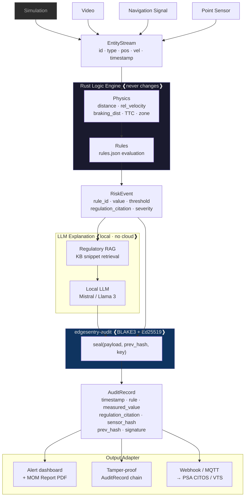

# clarus — PoC Roadmap: CAP Vista Submission to 6-Month Audit Log

- **Updated:** 2026-04-27 (input adapter complete)
- **Scope:** Phase 0 (build → submit) through Phase 2 (PoC site → actuarial-grade data)
- **Hard deadlines:** PIER71: 15 June 2026 · CAP Vista: 30 June 2026

---

## Architecture in one diagram



**Invariant:** the Rust engine and audit layer never change across inputs. The Input Adapter normalises any source into EntityStream — the engine sees only positions, velocities, and timestamps regardless of sensor type.

---

## Input Adapter — source types

Categories are defined by **data modality** (what the signal is), not by use case or industry.

### Simulation — synthetic coordinates (dev/test only)

| Source | Phase | Notes |
|---|---|---|
| Unity UDP coords | Phase 0 | Simulation output at 10 Hz; never deployed in production |
| CSV / JSON replay | Dev / test | Deterministic regression testing from recorded sessions |

### Video — pixel frames requiring vision model

| Source | Phase | Notes |
|---|---|---|
| Video file upload | Phase 0 demo | Offline analysis; same adapter as RTSP without live streaming |
| RTSP stream — IP camera | Phase 2 | Existing CCTV; vision model (YOLOv8) + tracker → EntityStream |
| RTSP stream — thermal camera | Phase 2 | Same adapter as IP camera; perimeter / night operations |

### Navigation signal — radio / RF position data

| Source | Phase | Notes |
|---|---|---|
| AIS NMEA 0183 | Phase 2 | Vessel position and kinematics; Rust re-implementation of arktrace logic |
| Radar track data | Phase 2+ | Vessel or vehicle detection; ASTERIX or proprietary format |
| GPS / GNSS | Phase 2+ | Vehicle or worker outdoor positioning |
| UWB tag | Phase 2+ | Sub-metre indoor worker/vehicle position; low latency |
| RFID tag | Phase 2+ | Zone-level worker/vehicle identification and position |

### Point sensor — spatial ranging or zone trigger hardware

| Source | Phase | Notes |
|---|---|---|
| LiDAR 2D/3D | Phase 2+ | Hokuyo; direct entity positioning — no vision model required |
| Area sensor / light curtain | Phase 2+ | Omron; boolean zone breach maps directly to `zone_membership` rule |

---

## Phase 0 — Build and Submit (now → 30 June 2026)

**Exit criteria:** CAP Vista submitted. PIER71 submitted if incorporation is complete by 8 June.

### Week 1–2: Rust engine + Unity input (due: 11 May)

Goal: `EntityStream` → `RiskEvent`. No vision, no LLM. Deterministic and testable.

**Tasks:**

- [x] `crates/input-adapter/src/unity_udp.rs` — UDP receiver, deserialise JSON into `EntityStream` ([PR #10](https://github.com/edgesentry/clarus/pull/10), 13 tests passing)
- [x] `crates/engine/src/physics.rs` — implement: ([PR #7](https://github.com/edgesentry/clarus/pull/7), 39 tests passing)
  - `euclidean_distance(a: &Entity, b: &Entity) -> f32`
  - `relative_velocity(a: &Entity, b: &Entity) -> f32`
  - `braking_distance(speed: f32, entity_class: EntityClass) -> f32`
  - `time_to_collision(distance: f32, approach_rate: f32) -> f32`
  - `zone_membership(pos: Vec2, polygon: &[Vec2]) -> bool`
- [x] `crates/engine/src/rules.rs` — load `rules.json`, evaluate each rule against `EntityStream`, emit `RiskEvent` ([PR #8](https://github.com/edgesentry/clarus/pull/8), 21 tests passing)
- [x] `profiles/sg-port-safety/rules.json` — 3 seed rules encoded ([PR #8](https://github.com/edgesentry/clarus/pull/8)):
  ```json
  { "rule_id": "MPA_CLEARANCE_5M",      "condition": "distance < 5.0",  "severity": "HIGH",     "regulation": "MPA Port Safety Circular No. 14 of 2023 §3.1" }
  { "rule_id": "EXCLUSION_ZONE_BREACH", "condition": "zone_member",     "severity": "CRITICAL", "regulation": "PSA Terminal Safety Rules §4.2" }
  { "rule_id": "TTC_CRITICAL_3S",       "condition": "ttc < 3.0",       "severity": "HIGH",     "regulation": "MPA Port Safety Circular No. 14 of 2023 §3.2" }
  ```
- [ ] Unity scene: flat terminal yard, forklift (box collider), pedestrian (capsule), UDP export at 10 Hz
- [x] CLI binary (`main.rs`) + CSV file replay (`file_replay.rs`) — ([PR #10](https://github.com/edgesentry/clarus/pull/10))

**Deliverable:** ✅ `cargo run --bin clarus -- --input file://fixtures/forklift_approach.csv --profile profiles/sg-port-safety` fires `MPA_CLEARANCE_5M` (HIGH) + `TTC_CRITICAL_3S` (HIGH) across all 15 frames; TTC drops 2.29 s → 0.89 s as FL-01 closes to 1.24 m. (86 tests passing across engine + adapter)

**Live UDP:** `--input udp://127.0.0.1:9000` ready; requires Unity scene (issue #6 — pending).

---

### Week 3–4: LLM explanation + regulatory RAG (due: 25 May)

Goal: `RiskEvent` → natural-language explanation with verifiable regulation citation.

**Tasks:**

- [ ] `crates/explanation/src/llm.rs` — local LLM inference via `llama.cpp` or `mlx` (Mistral 7B / Llama 3.2, Apple Silicon)
- [ ] `crates/explanation/src/rag.rs` — embed KB docs, retrieve top-1 snippet given `rule_id`
- [ ] `profiles/sg-port-safety/kb/` — seed with:
  - MPA Port Safety Circular No. 14 of 2023 (§§3.1, 3.2, 3.4)
  - MOM WSH (Docks) Regulations (relevant sections)
  - COLREGs Rules 5, 8, 16 (for maritime scenario)
- [ ] Prompt template:
  ```
  Event: {{rule_id}} fired. Measured: {{value}} {{unit}}. Threshold: {{threshold}} {{unit}}.
  Entities: {{entity_a}} ({{class_a}}) and {{entity_b}} ({{class_b}}).
  Physics: braking_distance={{braking_distance}}m, TTC={{ttc}}s.
  Regulation: {{kb_snippet}}
  Generate a one-paragraph plain-language alert for a safety officer.
  ```
- [ ] Grounding check: confirm LLM cites only text from `kb_snippet`; reject if it fabricates a citation
- [ ] Pipe `RiskEvent + explanation` into `edgesentry-audit::seal()` → `AuditRecord`

**Deliverable:** `AuditRecord` containing:
- `rule_id`, `measured_value`, `threshold_value`, `regulation_citation` (exact clause)
- `explanation` (one paragraph, grounded)
- `prev_record_hash`, `signature` (Ed25519)

**Validation:** run `edgesentry-audit verify <record>` → exits 0.

---

### Week 5: Browser demo (due: 1 June)

Goal: end-to-end screen-recordable demo showing the split-screen comparison and the full pipeline.

**Tasks:**

- [ ] `ui/` — minimal browser app (Axum or similar, or just a static HTML file served locally):
  - Split-screen view:
    - Left panel: "Generic proximity AI" mode — alert fires at every entity pair within 8 m (raw geometry, no physics)
    - Right panel: clarus mode — alert fires only when `braking_distance > remaining_distance`
  - Right panel event feed: click event → show explanation + regulation citation
  - "Generate MOM Report" button → export PDF containing:
    - Event timestamp, entities, measured value vs threshold
    - Exact regulation clause
    - `edgesentry-audit` hash and signature
    - Section heading: "Monitoring system: active and enforcing correct standard at time of event"
- [ ] `ui/verify.html` — paste AuditRecord JSON → show verification result (green/red)
- [ ] Record 5-min demo video:
  1. (0:00–0:30) Unity scene running, forklift approaching pedestrian
  2. (0:30–2:30) Split-screen: left fires 4 alerts on a safe pass, right fires 0; then forklift accelerates, right fires 1 alert at the correct TTC
  3. (2:30–4:00) Click the event → explanation appears → regulation citation shown
  4. (4:00–5:00) Click "Generate MOM Report" → PDF opens → run `verify` → green checkmark

**Deliverable:** `demo-capvista-2026.mp4` (5 min, screen recording at 1080p).

---

### Week 6: CAP Vista submission + PIER71 if eligible (due: 30 June)

**CAP Vista (due 30 June):**

- [ ] Add Tier-2 security scenario to Unity scene: vessel entity approaching restricted zone polygon
- [ ] Add `profiles/sg-maritime-security/rules.json`:
  - `RESTRICTED_ZONE_APPROACH` — CPA < 0.5 NM to defined polygon
  - `AIS_TRACK_GAP` — AIS silence > 8 min within port limits
- [ ] Swap KB to `profiles/sg-maritime-security/kb/` (COLREGs, Infrastructure Protection Act zones)
- [ ] Adjust LLM prompt for security context ("threat actor" framing vs "worker safety" framing)
- [ ] Complete application form narrative (from `clarus-commercial/docs/analysis/capvista-proposal-draft.md`)
- [ ] **Submit by 30 June, 13:00 SGT**

**PIER71 (due 15 June — only if incorporation confirmed by 8 June):**

- [ ] Reuse port safety demo (Tier-1 only; vessel scenario not required for PIER71-14)
- [ ] Complete PIER71 application form
- [ ] **Submit by 15 June**

> If incorporation is not confirmed by 8 June: skip PIER71, redirect time to CAP Vista polish.

---

## Phase 1 — Post-Submission Preparation (July – October 2026)

**Exit criteria:** PoC deployment package ready; Singapore port safety profile at production quality; first insurer contact made.

### Production-quality profile

- [ ] `profiles/sg-port-safety/rules.json` — expand from 3 demo rules to full set:
  - All MPA Port Safety Circular No. 14 of 2023 rules (§§3–7)
  - MOM WSH (Docks) Regulations §§12, 14, 18
  - Crane exclusion zone rules (swing radius by crane class)
  - Mooring line snap-back zone geometry
  - Gangway boarding swell check (if wave height sensor available)
- [ ] `profiles/sg-port-safety/params.toml` — validated per-class braking distances:
  - Forklift 3.5T @ 10 km/h: 4.1 m
  - Reach stacker @ 15 km/h: 8.2 m
  - Terminal tractor @ 20 km/h: 12.4 m
  - Person (pedestrian): 0 (static threshold)
- [ ] `profiles/sg-port-safety/manifest.toml`:
  ```toml
  jurisdiction = "SG"
  regulations = ["MPA-Circular-14-2023", "MOM-WSH-Docks-Regs-2020"]
  profile_version = "1.0.0"
  validated_date = "2026-07-01"
  ```

### Actuarial-grade audit log

Implement the full `AuditRecord` schema (required for Phase 2 insurance contact):

```rust
pub struct AuditRecord {
    pub event_id:           Uuid,
    pub timestamp_utc:      DateTime<Utc>,      // millisecond precision
    pub rule_id:            String,
    pub regulation_citation: String,            // "MPA Port Safety Circular No. 14 of 2023 §3.1"
    pub measured_value:     serde_json::Value,  // { "clearance_m": 3.2, "ttc_s": 2.3 }
    pub threshold_value:    serde_json::Value,  // { "min_clearance_m": 5.0 }
    pub sensor_id:          String,
    pub sensor_hash:        String,             // SHA-256 of firmware version + config
    pub profile_version:    String,             // "sg-port-safety@1.0.0"
    pub model_version:      Option<String>,     // vision model hash (Phase 2)
    pub prev_record_hash:   String,             // BLAKE3 of previous AuditRecord
    pub signature:          String,             // Ed25519 over all above fields
}
```

- [ ] Heartbeat records every 5 minutes (uptime proof)
- [ ] `edgesentry-audit verify-chain <log-file>` — validates entire hash chain
- [ ] Export: `edgesentry-audit export --format wica` — aligned with MOM WICA indicator definitions

### PoC deployment package

- [ ] `deploy/README.md` — step-by-step: install, configure sensor, start clarus, verify audit log
- [ ] `deploy/docker-compose.yml` — clarus + edgesentry-audit + local log storage
- [ ] `deploy/sensor-test.sh` — confirm Input Adapter is receiving EntityStream from site sensor
- [ ] `deploy/health-check.sh` — confirm heartbeat records are writing, chain is valid

---

## Phase 2 — PoC Execution (November 2026 – April 2027)

**Exit criteria:** 6 months of tamper-proof audit logs from 1–2 sites. Data packaged for actuarial presentation.

### Per-site setup (1–2 weeks per site)

- [ ] Identify sensor type at site: RTSP CCTV or AIS feed
- [ ] Implement site-specific Input Adapter:
  - RTSP: `crates/input-adapter/src/rtsp.rs` — vision model (YOLOv8 export) + tracker → EntityStream
  - AIS: `crates/input-adapter/src/ais_nmea.rs` — NMEA 0183 decoder → EntityStream (Rust re-implementation of arktrace logic; arktrace itself is Python and not a runtime dependency)
- [ ] Deploy production profile + run `sensor-test.sh`
- [ ] First AuditRecord generated → run `edgesentry-audit verify` → confirm chain valid
- [ ] Hand site contact the read-only audit log viewer URL

### Monthly during PoC

Each month, run:

```bash
# Generate monthly summary for PoC site and CAP Vista coordinator
clarus report monthly \
  --log audit.db \
  --from 2026-11-01 --to 2026-11-30 \
  --format pdf \
  --out reports/2026-11-monthly.pdf
```

Report contains:
- Total events by severity (CRITICAL / HIGH / MEDIUM / LOW)
- Month-on-month trend
- Top 3 rule IDs by frequency
- Uptime percentage (heartbeat coverage)
- Chain integrity: PASS / FAIL

Send to PoC site safety manager + CAP Vista programme coordinator.

### Month 4–6: Insurer data preparation

Build the Actuarial Simulation Environment CLI:

```bash
# Insurer feeds historical incident CSV → physics engine re-runs each event
clarus actuarial-sim \
  --incidents historical_incidents_2022_2024.csv \
  --profile profiles/sg-port-safety \
  --output actuarial_forecast_gard_2026.pdf
```

Output report structure:
1. Events re-run: N
2. Would have triggered HIGH/CRITICAL alert: X (Y%)
3. Median lead time before impact: Z seconds
4. Estimated incidents preventable per 100,000 man-hours: A
5. Corresponding expected claims reduction: SGD B / year (at insurer's own claim cost figures)

### 6-month data package (April 2027)

```
clarus-poc-results-2027-04/
  audit-chain.db          ← full 6-month AuditRecord chain
  chain-verify.txt        ← output of edgesentry-audit verify-chain (PASS)
  monthly-reports/        ← 6 × monthly PDFs
  actuarial-forecast.pdf  ← insurer simulation output
  profile-manifest.toml   ← exact rule set active throughout PoC
  sensor-config-hash.txt  ← SHA-256 of sensor firmware + config at each site
```

This package is the deliverable to CAP Vista, MPA, and the first insurer contact (Gard / Skuld / Sompo Japan Loss Prevention).

---

## Definition of Done — per phase

| Phase | Done when |
|---|---|
| Phase 0 | CAP Vista application submitted and receipt confirmed |
| Phase 1 | `deploy/` package on a clean machine produces a valid AuditRecord in < 30 minutes |
| Phase 2 | `edgesentry-audit verify-chain audit.db` exits 0 on 6 months of records; actuarial-forecast.pdf generated |

---

## Scope boundary (hard)

| In scope for Phase 0 | Out of scope until Phase 2 |
|---|---|
| Unity numeric input → RiskEvent | Live RTSP CCTV stream inference |
| Local LLM (no cloud) | Cloud sync or remote log storage |
| Browser demo + screen recording | Mobile or embedded deployment |
| edgesentry-audit chain | Multi-site log aggregation |
| PDF report generation | Real-time API push to PSA CITOS / MPA VTS |

---

## Key dependencies

| Dependency | Source | Notes |
|---|---|---|
| `edgesentry-audit` | `edgesentry/edgesentry-rs` | Production-ready; reuse from documaris |
| AIS parser | `crates/input-adapter/src/ais_nmea.rs` | Rust re-implementation of arktrace logic; arktrace (Python) is not a runtime dependency. If CPA/NMEA logic is later needed by other Rust projects, extract to a shared crate. |
| LLM runtime | `llama.cpp` or `mlx` | Apple Silicon; no cloud API |
| Vision model (Phase 2) | YOLOv8n export (ONNX) | Apache 2.0; fine-tune locally |
| Unity | Unity 2023 LTS | UDP export via custom C# component |
